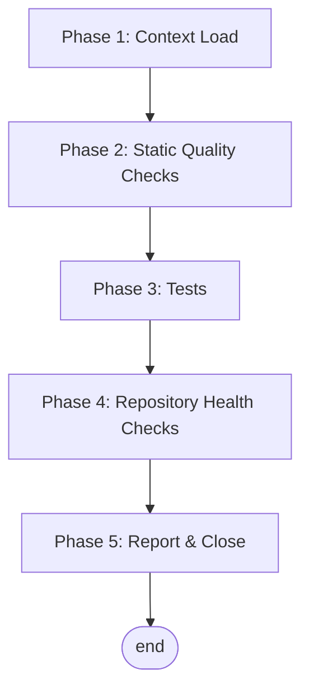

# Housekeeping Workflow

This is the recurring housekeeping workflow for the multi-agent recommendation repository — the routine that keeps the project healthy between feature work. It covers four concerns: (1) static quality of the codebase, (2) unit and integration test correctness, (3) repository-level health (dependency drift, dead code, documentation freshness), and (4) an append-only audit trail. Run it periodically or after any significant batch of changes. The `## Latest Report` section near the bottom is the baseline the next run compares against; older reports are archived to `housekeeping_log.jsonl` at the repo root.

**Execution model:** sequential — each phase has an explicit exit criterion and a remediation step.

**Prerequisites:**
- Python 3 with the packages in `requirements.txt` installed (`pip install -r requirements.txt`).
- A `worklog.jsonl` and `TODO_WORKFLOW.md` at the repo root for capturing significant agent sessions and deferred work. See `## JSONL Logs` below for the `housekeeping_log.jsonl` schema and the inline append pattern.

---

## Flow



Pure sequential — no branches, no loops, no HITL gates. Each phase has an explicit exit criterion and a remediation step; the run only advances when the prior phase is green or its drift has been recorded.

---

## JSONL Logs

This workflow's archive (Phase 5 Step 2) lives at `housekeeping_log.jsonl` at the repo root — append-only, one JSON record per line, oldest-first (newest at the end). Every line must parse independently as JSON. No script wraps the file: entries are constructed and appended inline. The schema below is the **canonical contract**.

**A related per-repo JSONL log — `worklog.jsonl`** — is written at session-wrap-up, not during housekeeping. Its schema and append protocol are documented in [TODO_WORKFLOW.md](TODO_WORKFLOW.md) § Worklog. Both files share shape conventions — append-only at repo root, oldest-first, `schema_version: 1`, `entry_id` unique within the file — but live separately because they're written at different lifecycle points.

### Record schema — `housekeeping_log.jsonl` (`schema_version: 1`)

```json
{
  "schema_version": 1,
  "entry_id":       "YYYY-MM-DD",
  "date":           "YYYY-MM-DD",
  "trigger":        "One-line context — what triggered the run",
  "metrics":        { "format": "n/a", "lint": "n/a", "tests": { "passed": 2, "failed": 0, "skipped": 1 } },
  "body_markdown":  "### Notable\n\n...\n\n### Outstanding\n\n- ..."
}
```

| Field | Type | Notes |
|:--|:--|:--|
| `schema_version` | int | Currently `1`. Bump on breaking changes. |
| `entry_id` | string | Unique within the file. Default `YYYY-MM-DD`; same-day collisions append `-b` / `-c` / `-d` in order. |
| `date` | string | ISO `YYYY-MM-DD` — the run date. |
| `trigger` | string | One-line context pulled from the Latest Report's `**Trigger:**` line. |
| `metrics` | object | Free-form dict — the same shape as the YAML block in the Latest Report Template at the bottom of this file. Treat the report's YAML block as the JSON dict in disguise. |
| `body_markdown` | string | Any `### Notable` / `### Outstanding` prose from the run, as one opaque markdown blob. Empty string when the run was clean and had nothing to add. Newlines escape as `\n`. |

### Append an entry (inline pattern — no script needed)

```bash
python3 - <<'PY' >> housekeeping_log.jsonl
import json
rec = {
    "schema_version": 1,
    "entry_id":       "2026-05-21",
    "date":           "2026-05-21",
    "trigger":        "Routine housekeeping cadence",
    "metrics":        {"format": "n/a", "lint": "n/a", "tests": {"passed": 2, "failed": 0, "skipped": 1}},
    "body_markdown":  "",
}
print(json.dumps(rec, ensure_ascii=False))
PY
```

The heredoc form is recommended because it (a) builds the record via `json.dumps` (string escaping handled correctly), (b) appends with shell `>>` (no read-modify-write), and (c) needs no project-specific helper.

Before appending, check existing entries for an `entry_id` collision and pick the next free `-b` / `-c` / `-d` suffix if today's run isn't the first of the day.

### Fresh repo bootstrap

A repo adopting this workflow starts with an empty file:

```bash
touch housekeeping_log.jsonl
```

The first archived entry lands via the inline append pattern above when Phase 5 Step 2 first runs.

---

## Phase 1 — Context Load

**Goal:** Identify the stack, tooling, and conventions of this repository before running any check.

### Step 1 — Discover the toolchain

1. Read `README.md` for documented test/run commands.
2. This repo is pure Python — dependencies are pinned in `requirements.txt`; there is no `Makefile`, `pyproject.toml`, formatter, linter, or type-checker configured. The check commands below reflect that.

### Step 2 — Read the prior baseline

Read the `## Latest Report` section at the bottom of this file. Note the previous test pass count, skipped count, and any unresolved follow-ups. These are the comparison points for this run.

**Exit criterion:** You have a concrete list of commands for this repo's checks, and the prior baseline is loaded.

---

## Phase 2 — Static Quality Checks

**Goal:** Verify the codebase is clean before exercising it.

### Step 1 — Format check

```text
n/a — no formatter configured. To add one: python -m black --check .
```

### Step 2 — Lint

```text
n/a — no linter configured. To add one: python -m ruff check .
```

### Step 3 — Type check

```text
n/a — no type checker configured. To add one: python -m mypy src
```

### Step 4 — Remediation

If a formatter, linter, or type checker is added later, fix findings in source — do not silence with inline disables or widen types with `Any` to bypass real bugs.

**Exit criterion:** Static checks pass, or are explicitly `n/a` for this repo.

---

## Phase 3 — Tests

**Goal:** Verify behavior is unbroken and the test suite has not silently shrunk.

### Step 1 — Unit tests

```bash
python -m pytest tests/ -v
# Alternative: python -m unittest discover tests
```

### Step 2 — Integration tests

```bash
python -m pytest tests/test_integration.py -v
```

Note: `tests/test_receptor_modulator.py` is a script-based visual test with no assertions — run it manually (`python tests/test_receptor_modulator.py`) and inspect the generated `receptor_modulator_test.png`; count it as `skipped` in the report.

### Step 3 — Test count comparison

Compare pass / fail / skipped counts against the prior `## Latest Report`. Any regression — newly failing tests, suddenly skipped tests, a reduced total without explanation — is a finding to investigate before closing the run.

**Exit criterion:** All tests pass. Test count is steady or higher than the prior report (or any drop has a documented justification).

---

## Phase 4 — Repository Health Checks

**Goal:** Catch slow-burning issues that lint and tests do not surface.

Pick the items relevant to this stack; mark the rest `n/a` in the report — do not delete the section so report shape stays stable across runs.

### Step 1 — Dependency drift

```bash
pip list --outdated
# Optional vulnerability audit: python -m pip_audit
```

Verify: no unaddressed vulnerability advisories; pinned versions in `requirements.txt` are not abandoned at end-of-life.

### Step 2 — Dead code / unused exports

```text
n/a — no dead-code tool configured. To add one: python -m vulture src
```

### Step 3 — Build smoke

```bash
python -c "import src.simulations, src.environment, src.reward_modulators"
```

The simulation package has no separate build step; a clean import of the core modules is the smoke test.

### Step 4 — Documentation freshness

- Does `README.md` still describe the actual commands and entrypoints?
- Are there `worklog.jsonl` or `TODO_WORKFLOW.md` entries that reference resolved work and should be cleaned up?

**Exit criterion:** No surprising drift. Anything actionable that is out of scope for this run is filed in `TODO_WORKFLOW.md` with a reproduction step.

---

## Phase 5 — Report & Close

**Goal:** Leave an auditable trail so the next housekeeping run has a baseline to compare against, without letting this file grow unboundedly.

### Step 1 — Append a new "Latest Report"

Replace the prior `## Latest Report` block with a new one using the compact-metrics shape at the bottom of this file. A clean run is ~15 lines; add `### Notable` / `### Outstanding` sections only when the run surfaced something worth reading.

### Step 2 — Archive the prior Latest Report

Append the previous `## Latest Report` block to `housekeeping_log.jsonl` per the schema and inline pattern documented in § JSONL Logs above. The `**Trigger:**` line becomes `trigger`; the YAML metrics block becomes `metrics`; any `### Notable` / `### Outstanding` prose becomes `body_markdown`; the run date becomes `date` and (after collision suffixing) `entry_id`.

### Step 3 — File follow-ups

If anything was found and not fixed, file it in `TODO_WORKFLOW.md` with enough context for a fresh agent to pick it up. Findings must not live only in this report.

### Step 4 — Bump `last_checked`

Update the `last_checked` field in this file's metadata header to today's date.

**Exit criterion:** The new compact-shape Latest Report reflects today's run, the prior report is archived to `housekeeping_log.jsonl`, deferred work is recorded in `TODO_WORKFLOW.md`, and tests are green or have explicit known-issue annotations.

---

## Quick Reference — Housekeeping Checklist

```text
[ ] Phase 1: Toolchain identified, prior baseline read
[ ] Phase 2: Format / lint / type checks — clean or n/a
[ ] Phase 3: Unit + integration tests — green; counts steady or improving
[ ] Phase 4: Dependency / dead-code / build / docs — no surprising drift
[ ] Phase 5: New Latest Report appended; prior report archived to housekeeping_log.jsonl; deferrals filed in TODO_WORKFLOW.md; last_checked bumped
```

---

## Latest Report

**Date:** 2026-05-21
**Trigger:** Routine housekeeping run (user-invoked).

```yaml
format:        n/a
lint:          n/a
types:         n/a
tests:         { passed: 2, failed: 0, skipped: 1 }
integration:   { passed: 1, failed: 0, skipped: 0 }
dependencies:  107 outdated
dead_code:     n/a
build:         FAIL — torch import error (missing libtorch_cpu.dylib)
docs:          1 drift item
```

### Notable

`tests/test_download_mock.py` (2 passed) and `tests/test_integration.py` (1 passed) are green — counts steady against the 2026-02-18 baseline. `tests/test_receptor_modulator.py` remains a script-based visual test with no assertions (counted as skipped).

Phase 4 build smoke (`import src.simulations`) **fails**: the `rec-env` conda environment's `torch` install is broken — the dylibs under `torch/lib/` are symlinks to a non-existent `libtorch_cpu.dylib`. The unit/integration suite is unaffected because no test imports `torch`/`reward_modulators`, but any simulation run is blocked. The repo code is not at fault — this is local environment corruption.

`requirements.txt` pins drift from the `rec-env` interpreter: torch 2.9.1→2.5.1, numpy 2.3.2→1.26.4, pandas 2.3.2→2.3.1, matplotlib 3.10.5→3.10.0, scipy 1.16.1→1.15.3. 107 packages report newer releases (routine for a long-lived conda env).

### Outstanding

- **[filed → TODO_WORKFLOW.md]** Broken `torch` install in `rec-env` blocks the build smoke test.
- **[filed → TODO_WORKFLOW.md]** `README.md` § "Testing the ReceptorModulator" gives `python test_receptor_modulator.py`, but the file lives at `tests/test_receptor_modulator.py`.

---

## Latest Report Template

Copy the block below and fill it in for each housekeeping run. Only the most recent run lives inline as `## Latest Report`; on the next run, the prior block is archived to `housekeeping_log.jsonl` (see Phase 5 Step 2).

````markdown
## Latest Report

**Date:** {{YYYY-MM-DD}}
**Trigger:** {{One line — routine cadence, post-release, post-merge, post-incident, etc.}}

```yaml
format:        ok | N issues | n/a
lint:          ok | { errors: N, warnings: N } | n/a
types:         ok | N errors | n/a
tests:         { passed: N, failed: N, skipped: N }
integration:   { passed: N, failed: N, skipped: N }
dependencies:  ok | N outdated | N advisories
dead_code:     ok | N findings | n/a
build:         ok | <failure cause>
docs:          ok | N drift items
```

### Notable

{{Omit on clean runs; otherwise a short paragraph for real signal — newly failing tests, regressions, root-caused surprises, decisions made.}}

### Outstanding

{{Omit when empty; otherwise a short bullet list of new items or carried-forward backlog references.}}
````
